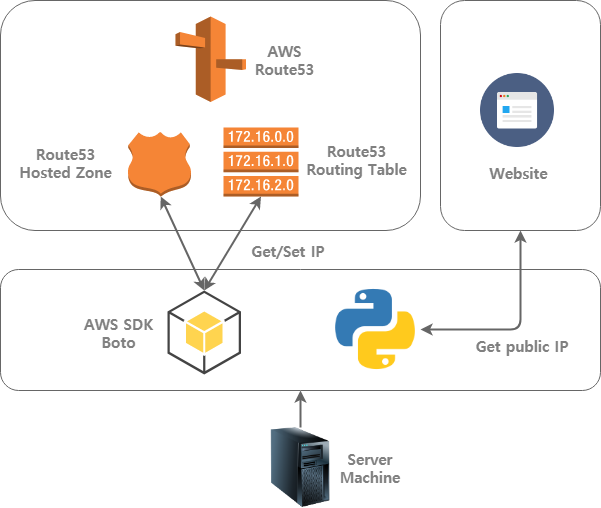

# DDNS-Route53
[](https://github.com/dongbum/DDNS-Route53/blob/master/LICENSE)
[](https://travis-ci.com/dongbum/DDNS-Route53)
[](https://coveralls.io/github/dongbum/DDNS-Route53?branch=master)

AWS Route53 Dynamic-DNS client made with Python.

## Requirements
Python 3.6 or above

## Installation
Run `pip install -r requirements.txt`

## Configuration
Make `config.ini` file on root directory.

* ```DOMAIN``` : Set your domain. (exclude 'http://')
* ```AWS_HOSTED_ZONE_ID``` : AWS hosted zone ID for Route53
* ```AWS_ACCESS_KEY_ID``` : AWS access key ID for Route53
* ```AWS_ACCESS_SECRET_KEY``` : AWS access secret key for Route53
* ```GET_IP``` : Set detect for changing public IP (```AWS``` or ```FILE```)
* ```CHECK_URL``` : Website for getting public IP (Only contain IP string)
* ```LOG``` : Log file path (Absoulte)

Example :
```INI
[DEFAULT]
DOMAIN=test.mydomain.com
AWS_HOSTED_ZONE_ID=ABCD123
AWS_ACCESS_KEY_ID=EFGH456
AWS_ACCESS_SECRET_KEY=IJKL789
GET_IP=AWS
CHECK_URL=http://bot.whatismyipaddress.com
LOG=D:\logdir\logfilename.log
```

## Usage
Copy ```config.example.ini``` to ```config.ini``` and edit for your enviroment.
Run `python3 update.py` command on shell or cmd.

## Architecture


## License
Please see [LICENSE](LICENSE) file for more details.
